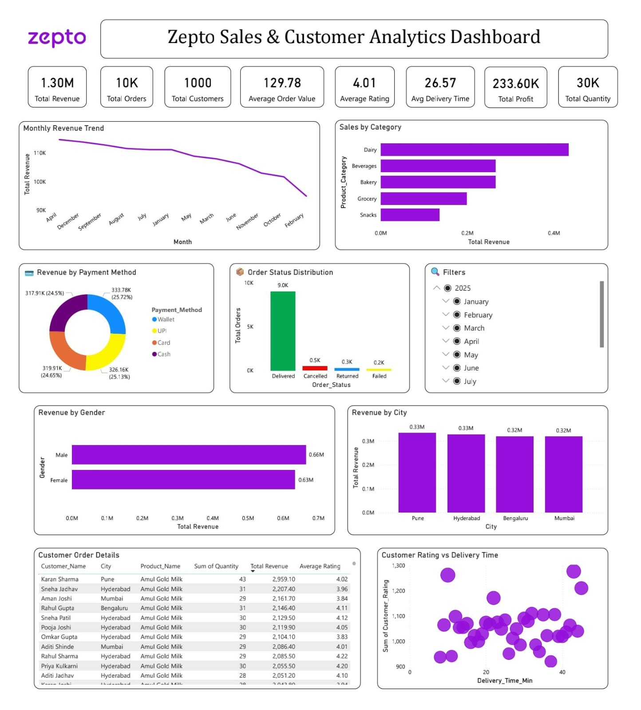

# 🛒 Zepto Sales & Customer Analytics Dashboard

## 📌 Project Overview

This Power BI dashboard provides an interactive analysis of Zepto sales, customer behavior, delivery performance, and overall business insights.

The dashboard helps identify revenue trends, customer purchasing patterns, payment preferences, and product category performance.

---

## 📊 Dashboard Preview

---

## 🚀 Key KPIs

- Total Revenue
- Total Orders
- Total Customers
- Total Profit
- Average Order Value
- Average Customer Rating
- Average Delivery Time
- Total Quantity Sold

---

## 📈 Dashboard Features

- Monthly Revenue Trend
- Sales by Product Category
- Revenue by Payment Method
- Order Status Distribution
- Revenue by Gender
- Revenue by City
- Customer Rating vs Delivery Time
- Customer Order Details
- Interactive Filters

---

## 🛠️ Tools Used

- Power BI
- Microsoft Excel
- DAX
- Data Modeling

---

## 📂 Files Included

- Zepto Dashboard.pbix
- zepto.xlsx
- Dashboard.jpeg

---

## 📧 Author

**Arjun Waghmare**

